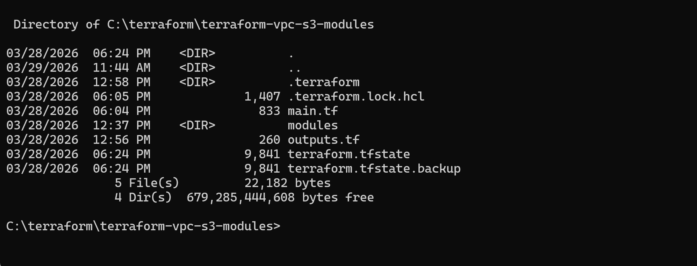
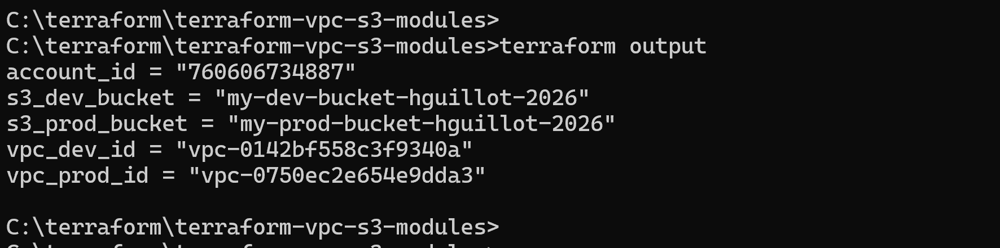
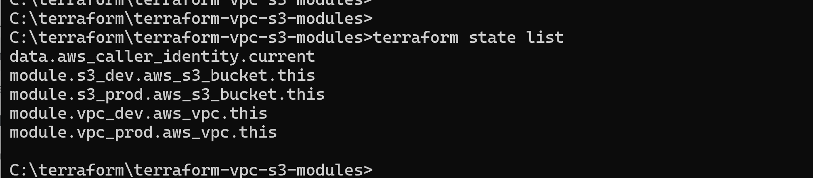

<h1>☁️ Terraform Modules Lab – VPC & S3 (Dev/Prod)</h1>

  
  
  
  
  
  

________________________________________

📌 Description

This lab demonstrates how to use Terraform modules to deploy a simple AWS infrastructure with two environments:

•	Development (dev)

•	Production (prod)

Each environment includes:

•	1 VPC
•	1 S3 bucket

👉 Total resources: 2 VPC + 2 S3 buckets
________________________________________
🧱 Project Structure

terraform-vpc-s3-modules/
│
├── main.tf
├── variables.tf
├── outputs.tf
│
├── modules/
│   ├── vpc/
│   └── s3/

  

________________________________________
⚙️ Prerequisites

•	Terraform ≥ 1.3
•	AWS CLI configured
•	AWS account with appropriate permissions
________________________________________
🚀 Usage

terraform init

terraform plan

terraform apply
________________________________________
📊 Outputs

To display outputs after deployment:

terraform output

  

________________________________________

To dislay created ressources in AWS :

terraform state list

  

________________________________________
⚠️ Notes

•	S3 bucket names must be globally unique

•	VPC CIDR blocks must not overlap

•	S3 is not deployed inside a VPC (AWS limitation)
________________________________________
🎯 Learning Objectives

•	Understand Terraform modules
•	Work with multi-environment infrastructure
•	Manage basic AWS resources (VPC, S3)
•	Use Terraform outputs
________________________________________
👤 Author
Henri Guillot

